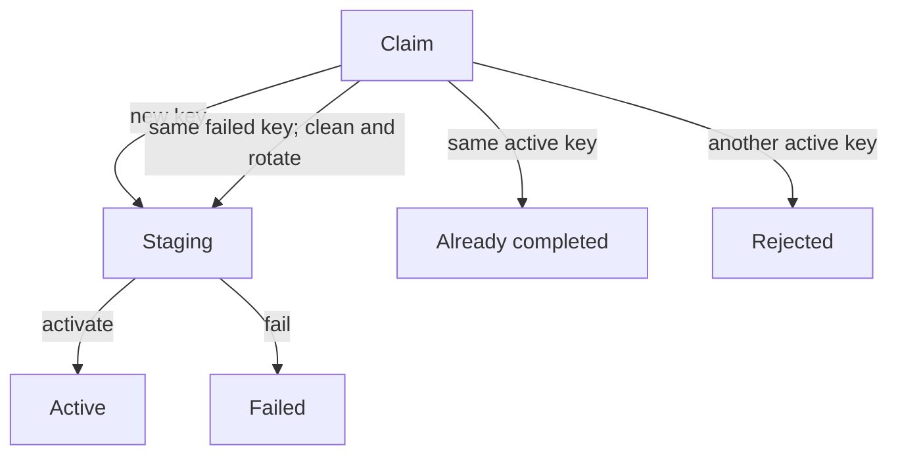

# youmad/endurance-activity-postgresql

Doctrine DBAL adapters and migrations for PostgreSQL activity storage.

The package uses Doctrine DBAL directly. It does not require or use Doctrine ORM.

The package implements the staging ports introduced by `youmad/endurance-activity` and
keeps imported child rows invisible until the corresponding import generation
is activated atomically.

## Installation

```bash
composer require youmad/endurance-activity-postgresql
```

The package is tested with PostgreSQL 18.

## Features

- import-generation claim, retry, failure and activation state;
- short independently committed staging writes;
- bulk inserts for activity and device-status observations;
- staged persistence for laps, activity details, sessions and devices;
- JSON payload encoding for all current activity telemetry and detail forms;
- active views that expose only rows belonging to the activity's active import
  generation;
- aggregate persistence through `DoctrineDbalActivityRepository`;
- optimistic locking through `activities.version`;
- a Doctrine DBAL implementation of `ActivityTransaction`;
- durable activity-import status, processing claims/heartbeats, structured completion warnings and source-file cleanup claims.

`DoctrineDbalActivityRepository` and `DoctrineDbalActivityTransaction` share
one DBAL connection by construction. Aggregate persistence and generation
activation therefore participate in the same final transaction.

## Schema ownership

The package owns and ships the complete Doctrine migration history for its
PostgreSQL schema under `migrations/`. It does not register or execute those
migrations. That remains the responsibility of the consuming application.

The package migrations create:

- the `activities` aggregate table;
- the `activity_imports` lifecycle, warning and file-cleanup metadata table;
- `activity_import_generations`;
- `activities.active_import_generation_id`;
- six generation-owned staging tables;
- six `active_activity_import_*` views;
- all required indexes, constraints and foreign keys.

Consumers must read imported child data through the active views, not directly
from the staging tables.

A Symfony application using DoctrineMigrationsBundle can register the bundled
history as follows:

```yaml
doctrine_migrations:
    migrations_paths:
        'Youmad\Endurance\ActivityPostgresql\Migrations': '%kernel.project_dir%/vendor/youmad/endurance-activity-postgresql/migrations'
```

## Processing-attempt ownership

Each `activity_imports` processing attempt owns a generated
`processing_claim_id`. Starting an already `processing` import does not steal
that claim. Completion, permanent failure, heartbeat and recoverable release
all require the exact claim that started the attempt. A recoverable release
returns the import to `queued`; the next Messenger delivery receives a new
claim and increments `attempt_count`.

`processing_heartbeat_at` is initialized with the claim and refreshed by the
ingest pipeline at a throttled interval while FIT messages and buffered import
items continue to make progress. Operational stale-import diagnostics use that
heartbeat rather than `updated_at`.

## Generation lifecycle



There may be at most one `staging` and one `active` generation per activity.
The current aggregate model intentionally permits only one successfully
imported generation per activity.

## Transaction and lock model

Generation management always locks rows in this order:

1. `activities` row with `FOR UPDATE`;
2. `activity_import_generations` row with `FOR UPDATE`.

A staging writer locks only the generation with `FOR SHARE`, checks that it
belongs to the supplied activity and is still `staging`, writes its rows and
commits.

This prevents activation or failure from racing with a late staging batch.
Retrying a failed generation atomically removes its staged rows and rotates the
generation UUID before returning the new claim. The old UUID therefore acts as
a fencing token: a delayed worker from the previous attempt can no longer
append, activate, or fail the retried generation.
`DoctrineDbalStagedWriteExecutor` rejects calls made inside an existing outer
transaction because staging batches must remain short, independently committed
operations.

The final activation transaction performs only:

1. application-supplied aggregate persistence;
2. assignment of `activities.active_import_generation_id`;
3. transition of the generation from `staging` to `active`.

## Composition

```php
<?php

declare(strict_types=1);

use Doctrine\DBAL\Connection;
use Youmad\Endurance\Activity\Application\Batch\BatchingStagedActivityObservationWriter;
use Youmad\Endurance\Activity\Application\Batch\BatchingStagedDeviceStatusObservationWriter;
use Youmad\Endurance\Activity\Application\Import\ActivityImportItemDispatcher;
use Youmad\Endurance\Activity\Application\Import\Handler\ActivityDetailItemHandler;
use Youmad\Endurance\Activity\Application\Import\Handler\ActivityLifecycleItemHandler;
use Youmad\Endurance\Activity\Application\Import\Handler\ActivitySummaryItemHandler;
use Youmad\Endurance\Activity\Application\Import\Handler\DeviceItemHandler;
use Youmad\Endurance\Activity\Application\Import\Handler\DeviceStatusItemHandler;
use Youmad\Endurance\Activity\Application\Import\Handler\LapItemHandler;
use Youmad\Endurance\Activity\Application\Import\Handler\ObservationItemHandler;
use Youmad\Endurance\Activity\Application\Import\Handler\SessionItemHandler;
use Youmad\Endurance\Activity\Application\UseCase\ActivityImportGenerationCoordinator;
use Youmad\Endurance\Activity\Application\UseCase\ImportActivityStream;
use Youmad\Endurance\ActivityPostgresql\Activity\ActivityRowMapper;
use Youmad\Endurance\ActivityPostgresql\Activity\DoctrineDbalActivityRepository;
use Youmad\Endurance\ActivityPostgresql\Connection\DoctrineDbalActivityTransaction;
use Youmad\Endurance\ActivityPostgresql\Import\DoctrineDbalActivityImportGenerationRepository;
use Youmad\Endurance\ActivityPostgresql\Import\DoctrineDbalStagedActivityDetailWriter;
use Youmad\Endurance\ActivityPostgresql\Import\DoctrineDbalStagedActivityDeviceWriter;
use Youmad\Endurance\ActivityPostgresql\Import\DoctrineDbalStagedActivityObservationBatchWriter;
use Youmad\Endurance\ActivityPostgresql\Import\DoctrineDbalStagedActivitySessionWriter;
use Youmad\Endurance\ActivityPostgresql\Import\DoctrineDbalStagedDeviceStatusObservationBatchWriter;
use Youmad\Endurance\ActivityPostgresql\Import\DoctrineDbalStagedLapWriter;
use Youmad\Endurance\ActivityPostgresql\Import\DoctrineDbalStagedWriteExecutor;

$transaction = new DoctrineDbalActivityTransaction($connection);
$activityRepository = new DoctrineDbalActivityRepository(
    transaction: $transaction,
    rows: new ActivityRowMapper(),
);
$generations = new DoctrineDbalActivityImportGenerationRepository(
    $transaction,
);
$coordinator = new ActivityImportGenerationCoordinator(
    generations: $generations,
    transaction: $transaction,
);
$stagedWrites = new DoctrineDbalStagedWriteExecutor($transaction);

$observations = new BatchingStagedActivityObservationWriter(
    writer: new DoctrineDbalStagedActivityObservationBatchWriter(
        $stagedWrites,
    ),
    batchSize: 500,
);
$deviceStatuses = new BatchingStagedDeviceStatusObservationWriter(
    writer: new DoctrineDbalStagedDeviceStatusObservationBatchWriter(
        $stagedWrites,
    ),
    batchSize: 100,
);

$dispatcher = new ActivityImportItemDispatcher(
    new ObservationItemHandler($observations),
    new LapItemHandler(new DoctrineDbalStagedLapWriter($stagedWrites)),
    new ActivityDetailItemHandler(
        new DoctrineDbalStagedActivityDetailWriter($stagedWrites),
    ),
    new SessionItemHandler(
        new DoctrineDbalStagedActivitySessionWriter($stagedWrites),
    ),
    new DeviceItemHandler(
        new DoctrineDbalStagedActivityDeviceWriter($stagedWrites),
    ),
    new DeviceStatusItemHandler($deviceStatuses),
    new ActivityLifecycleItemHandler($lifecycleEvents),
    new ActivitySummaryItemHandler($summaries),
);

$importer = new ImportActivityStream(
    activities: $activityRepository,
    generations: $coordinator,
    dispatcher: $dispatcher,
);
```

`$lifecycleEvents` and `$summaries` are application services from the existing
activity composition. `DoctrineDbalActivityRepository` receives the same
transaction adapter as generation persistence, so it cannot accidentally use
a different connection.

## Aggregate persistence

`Activity::snapshot()` exports only the compact state required to continue
aggregate invariant checks. Imported observations, laps, details, sessions and
devices remain in generation-owned relations and are not duplicated in the
aggregate row.

A loaded aggregate is associated with its database version inside the
repository. `save()` updates with `WHERE version = :expected_version` and
increments the version. A stale aggregate therefore fails instead of replacing
changes committed while a long FIT stream was being decoded.

An aggregate instance involved in a rolled-back transaction must be discarded,
which is the normal request/message-handler lifecycle. Reload it before retrying
a failed operation.

## Payload format

Every staging table contains:

- query and ordering columns in native PostgreSQL types;
- `payload_version`;
- the full current representation in `jsonb`.

Version 1 preserves:

- all six measurement forms;
- measurement source, origin and optional source-specific metadata;
- activity observation readings;
- lap and session readings;
- pool lengths and segment efforts;
- device descriptors and status measurements;
- UTC timestamps with microsecond precision.

## Reading track measurements

Track reads preserve every scalar reading in payload order, together with
its `origin` and source device/attribution. Repeated types are valid in an
ActivityObservation and no longer make the track unreadable. Missing legacy
provenance becomes a null origin and unknown source; malformed provenance
that is present is rejected.

The convenience fields (`heartRate`, `speed`, `altitude`, and others) are null
for a type with multiple readings. No first/last reading or source priority
is inferred. The full list remains available from `measurements()`. Summary
reads still enforce the Lap/Session domain's unique-type rule.

This change reads the existing version-1 payload and requires no migration
or reimport. Source-specific metadata remains stored in the payload and is
outside this scalar read projection.

## Tests

Fast unit tests:

```bash
composer install
composer test
```

Disposable PostgreSQL integration tests:

```bash
composer test:integration
```

All tests:

```bash
composer test:all
```

The integration runner starts a disposable PostgreSQL 18 container, applies
this package's migrations and then runs PHPUnit. It cleans up the container
afterward; set `KEEP_TEST_DATABASE=1` to retain it after a failure.

To use an existing dedicated test database, set
`TRACKER_TEST_DATABASE_MODE=external`, `TRACKER_TEST_DATABASE_HOST`, and, if
needed, `TRACKER_TEST_DATABASE_PORT`, `TRACKER_TEST_DATABASE_NAME`,
`TRACKER_TEST_DATABASE_USER`, and `TRACKER_TEST_DATABASE_PASSWORD` before
running `composer test:integration`. The database name must be `test`, start
with `test_` or `test-`, or end with `_test`. The suite applies its migrations
and truncates public application tables between tests.

`composer check` also runs PHPStan and PHP CS Fixer checks.

## Failed-generation retention

Failed generations are deliberately retained until a retry or explicit
cleanup. Retrying the same idempotency key removes its old staged rows
atomically, rotates the generation UUID, increments `attempt_count`, and
reclaims the row as `staging`. Applications should define a retention policy
for failed generations and their payloads.

## License

The project-authored source code, migrations, tests, and documentation
in this package are licensed under the Mozilla Public License 2.0 (`MPL-2.0`).

> This Source Code Form is subject to the terms of the Mozilla Public
> License, v. 2.0. If a copy of the MPL was not distributed with this
> file, You can obtain one at https://mozilla.org/MPL/2.0/.

See [LICENSE](LICENSE). Dependencies retain their own licenses.

## Measurement metadata storage

New import payloads store optional reading metadata as
`{"type": "fit.developer_field", "version": 1, "data": {...}}` or `null`.
The metadata implementation supplies the representation. This adapter validates
its type, version, named data fields, and recursively JSON-compatible values;
it does not inspect object properties or depend on source-specific classes.
Nested values are limited to 64 array levels below each data field. Unsupported
values fail persistence explicitly instead of being silently reduced to public
properties.

Previously stored `{"class": ..., "properties": ...}` metadata is left intact.
No migration or reimport is required for existing read endpoints: scalar read
models do not interpret or expose metadata, and accept both envelopes as opaque
payload content. This is compatibility of existing reads, not conversion or
reconstruction of legacy metadata objects. A future metadata read API must
explicitly handle legacy envelopes and unknown type/version pairs without
instantiating a class named in stored data. Old and new payloads are not bytewise
equivalent; external consumers inspecting raw JSON must support both shapes.

## Persisted summary adjacency

New lap and session payloads include `adjacency_policy` with the stable policy
identifier. Read models restore it independently of
`timeline_resolution_microseconds`. Only absence of the key selects the legacy
resolution-based rule; null, non-string, and unknown policy values are rejected.
Existing payloads need no migration or reimport. No new column is required:
policy is stored in the existing JSON payload, and the schema has no cross-row
summary adjacency constraint to replace. Existing timestamp and duration
constraints remain unchanged. Older application versions ignore the new field;
rollback to them is not safe for data using a policy different from the legacy
resolution-based selection. FIT data continues to use that same selection.
